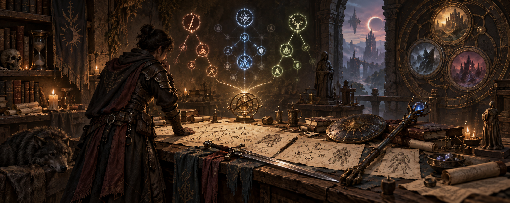

# ARPG Build Lab

A workshop for exploring Last Epoch builds and learning how machine learning
works along the way.

The goal is to start with a real build, explore changes, and find useful tradeoffs
between damage, survivability, and movement. Alongside that, we want to understand
what models learn, where their predictions fail, and how to make them better.
Small experiments, visible results, and an honest record of what worked and what
didn't.

The project is just getting started.
