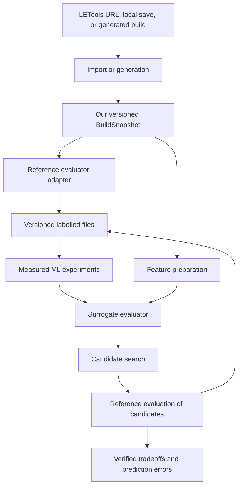

# Architecture direction

This is a repository scaffold. The folders below reserve responsibilities;
the contracts, importer, evaluators, datasets, and models are not implemented.

## Two goals

Build a useful Last Epoch build explorer while learning traditional ML through
measured experiments. Favor changes that serve both goals. Last Epoch is the
only supported game planned for now; there is no cross-game abstraction.

## Intended data flow

This diagram describes the intended product. The next implementation is only the
LETools import path.

## Ownership

| Directory | Responsibility | Dependencies |
| --- | --- | --- |
| `src/domain/` | Canonical build, validity rules, normalized evaluation | No adapter or ML dependencies |
| `src/importers/` | Recognize and normalize external builds | Domain |
| `src/evaluators/` | Run calculators and normalize results | Domain and chosen calculator integration |
| `ml/` | Prepare features, train models, measure errors | Domain and versioned datasets |

A future command or UI coordinates these components. Add generation, mutation,
and search components when the corresponding work begins. Modules expose the
contracts their callers need and keep internal representations local.

## Data that we own

Define the smallest useful Last Epoch `BuildSnapshot` after inspecting a real
import. The handoff in the epic is a design sketch, not an accepted schema.
It identifies character, passives, skills, equipment, idols, blessings, game
version, and source provenance as likely contents.

Keep schema version, game version, source version, and evaluator version
separate. Use stable game IDs when available. Never silently combine game
versions or infer an exact version without evidence. Unknown version handling
is an explicit importer decision before evaluation or dataset use.

`BuildEvaluation` should normalize only metrics the integration supports, with
units and missing-value meaning defined. Retain raw results outside Git for
investigation. External calculators provide reference labels and can disagree.
They do not define our canonical model.

## Application language and integration

Write all application code we own in Python, including domain rules, importers,
evaluation adapters, build manipulation, search, ML, orchestration, and any
future UI. Introduce another language only when a concrete problem in our
application justifies it. Record the problem and the reason for that choice
when it arises.

External tools and libraries may use any language or runtime, such as a Lua
calculator. Keep external tool integrations behind adapters and choose the
simplest supported integration that meets our needs.

Reuse canonical domain types and validity rules across Python modules. Keep ML
dependencies out of the domain and importer code. Use versioned files for build
snapshots, datasets, and reproducible experiment artifacts; file exchange is
not required between Python modules. Agree on and validate each persisted or
external exchange format when its first consumer exists. Add processes or
services only for a demonstrated need.

## Learning and reuse

Begin with a narrow target and compare useful simple baselines before increasing
model complexity. Generated data and real imported builds serve different
purposes. The former supplies controlled examples; the latter helps seed and
validate realistic behavior. Keep the experiment's split and scope visible.

Optimization can find predictions the surrogate gets badly wrong. Preserve
those candidates for investigation, reference verification, and possible active
learning rather than hiding their errors.
